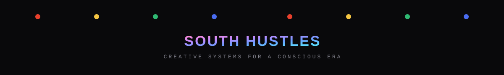

<div align="center">

</div>

<br/>

<div align="center">

### [d2ewbctayp91bl.cloudfront.net](https://d2ewbctayp91bl.cloudfront.net)

[](#)
[](https://threejs.org)
[](https://www.terraform.io)
[](#)
[](.github/workflows)

</div>


## Portfolio de estudio creativo · Three.js en vivo · Infra propia end-to-end

**South Hustles** — no es una landing de agencia con un slider de "nuestros servicios". Es el **sistema operativo de un estudio creativo**: dirección, tecnología y emoción, construido como una experiencia que se recorre, no que se lee. Un orbe holográfico en WebGL saluda en el hero, un dosel de árboles generativo respira en `#canopy`, un campo de partículas responde al cursor en `#magnetic`, y una universidad de cursos codificados por color le pierde el miedo — a propósito — a usar rojo, ámbar, verde y azul en un sitio que podría haberse escondido detrás de escala de grises.

Esto no es un template Webflow reexportado. Es la reconstrucción **vanilla, sin build step**, de un portfolio que originalmente vivía en Webflow — ahora es HTML/CSS/JS puro, versionado, con su propia infraestructura AWS provisionada por Terraform, y un pipeline de CI/CD donde **cada cambio pasa por una PR que Franco aprueba a mano** antes de tocar producción.

El repo entero es **additive-only**: se construye reutilizando piezas ya probadas en los otros estudios de Franco (`la-caravana-club`, `apacheta-app`, `ant-on-mars`) — el `reference/` folder existe exactamente para eso, código estudiado, nunca borrado, listo para injertar.

> *"Creative systems for a conscious era — dirección, tecnología y emoción para experiencias que viven en el espacio digital."*


## Por qué importa técnicamente

**Para equipos de AWS / Infra:**
La arquitectura prueba que un portfolio de alto diseño (WebGL, tres canvases Three.js simultáneos, fuentes variables, animaciones de scroll) puede vivir en el tier más barato posible de AWS: **S3 static website + CloudFront**, sin servidor, sin contenedor en producción, sin factura de cómputo. Terraform gestiona **solo** la distribución CloudFront — el bucket S3 se referencia como `data source` de solo lectura, precisamente para que `terraform apply` nunca pueda borrar o recrear el bucket de producción por accidente.

**Para equipos de DevOps / CI-CD:**
El pipeline separa limpiamente **validación** de **deploy**. `ci.yml` corre en cada PR: levanta el sitio en Docker + Nginx, lo smoke-testea por HTTP, valida formato y sintaxis de Terraform — todo sin credenciales de AWS. `deploy.yml` corre **solo** en push a `main`, y lo único que hace contra AWS es `aws s3 sync` + una invalidación de CloudFront. Ningún workflow ejecuta jamás `terraform apply` — ese comando se corre a mano, una vez, desde la laptop de Franco.

**Para equipos de Producto / Portfolio:**
La hipótesis: un estudio que vende dirección creativa y sistemas generativos no puede tener un sitio que se sienta como un template. Cada sección — Live System, Ecosystem, University, Magnetic, Gravity, Canopy, Journal — es una pieza de producto en sí misma, no un bloque de marketing genérico. El sitio *es* el case study.

**Para equipos de Front-End / WebGL:**
Tres canvases Three.js corriendo secciones independientes (`sh2-three.js`, `sh2-canopy.js`, hero `hero-glb.js`) más un GLB cacheado una sola vez (`glb-cache.js`) y reutilizado entre el hero y el case study traveler — un solo fetch, un solo parse. Sin bundler: import maps cargando Three.js directo desde CDN, `modulepreload` disparando la descarga del loader antes de que el navegador llegue al `<script>` de cierre.


## Pipeline · Local repo → Terraform → S3 → CloudFront → dominio

El producto no es solo el sitio — es la cadena completa desde un commit local hasta el edge de CloudFront, y quién tiene permiso de mover cada eslabón:

```
┌───────────────────────────────────────────┐
│  LOCAL                                     │
│  branch propia · editar app/ · commit      │
└───────────────────────────────────────────┘
                    │  git push
                    ▼
┌───────────────────────────────────────────────────────┐
│  PULL REQUEST → main                                   │
│  ci.yml (sin credenciales AWS):                        │
│    · valida estructura del repo (app/ infra/ docs/)    │
│    · docker build ./app + docker run + smoke test HTTP │
│    · terraform fmt -check + validate (infra/)          │
└───────────────────────────────────────────────────────┘
                    │
                    ▼
┌───────────────────────────────────────────┐
│  FRANCO REVISA EL DIFF Y EL CI, Y MERGEA    │
│  nada se despliega antes de este merge      │
└───────────────────────────────────────────┘
                    │  merge a main
                    ▼
┌────────────────────────────────────────────────────────────┐
│  deploy.yml (solo push a main, con secrets de AWS)          │
│  aws s3 sync app/ s3://south-hustles-prod/ --delete         │
│  aws cloudfront create-invalidation --paths "/*"            │
└────────────────────────────────────────────────────────────┘
                    │
                    ▼
┌────────────────────────────────────────────┐
│  S3 static website · south-hustles-prod      │
│  provisionado a mano en la consola AWS       │
└────────────────────────────────────────────┘
                    │
                    ▼
┌──────────────────────────────────────────────────────┐
│  CloudFront · d2ewbctayp91bl.cloudfront.net           │
│  único recurso que Terraform realmente crea            │
│  HTTPS en el edge — el S3 endpoint solo habla HTTP     │
└──────────────────────────────────────────────────────┘
                    │
                    ▼
┌──────────────────────────────────────────────┐
│  southhustles.com  (pendiente)                │
│  ACM cert us-east-1 + Route53 alias + CNAME   │
└──────────────────────────────────────────────┘
```

### Lo que está provisionado hoy

| Recurso | Cómo se creó | Quién lo toca |
|---|---|---|
| **S3 bucket** `south-hustles-prod` (us-east-1) | A mano en la consola AWS — hosting estático habilitado, política pública de lectura | Nadie vía Terraform: `main.tf` solo tiene un `data "aws_s3_bucket"` de solo lectura |
| **CloudFront** `d2ewbctayp91bl.cloudfront.net` | `terraform apply`, corrido una vez, local | Único recurso que Terraform gestiona (`aws_cloudfront_distribution.site_cdn`) |
| **IAM user** `south-hustles-ci` | A mano, con `AmazonS3FullAccess` + `CloudFrontFullAccess` | Usado por `deploy.yml` (solo `s3 sync`); el scope de CloudFront quedó de la corrida inicial de `apply` — candidato a separarse en dos usuarios |
| **Terraform state** | Local (`infra/terraform.tfstate`, gitignored) | Vive en la máquina que corrió `apply` — sin backend remoto todavía |
| **Dominio** `southhustles.com` | No wireado aún | Slot ya reservado en `main.tf` para ACM + Route53 alias, cambio aditivo cuando el dominio esté listo |


## Secciones del sitio

<table>
<tr>
<td align="center" width="25%">
<br/>

<br/>
<b>Hero + Live System</b>
<br/><br/>
<sub>Loader con wordmark y porcentaje de carga real, orbe holográfico renderizado en un <code>&lt;canvas&gt;</code> Three.js (<code>hero-glb.js</code>), widget de coordenadas en vivo. La primera impresión ya demuestra la capacidad técnica del estudio — no es un hero estático con foto de stock.</sub>
<br/><br/>
</td>
<td align="center" width="25%">
<br/>

<br/>
<b>Ecosystem + Canopy</b>
<br/><br/>
<sub>Collage editorial + scroll horizontal de stickers, y más abajo un dosel de árboles generativo en su propio canvas (<code>sh2-canopy.js</code>) que respira con scroll. El sitio pasa de tipografía a naturaleza generativa sin transición brusca.</sub>
<br/><br/>
</td>
<td align="center" width="25%">
<br/>

<br/>
<b>University</b>
<br/><br/>
<sub>Cursos como tarjetas de color sólido — rojo, ámbar, verde, azul. <em>"Perder el miedo a los colores"</em> en un sitio que de otra forma viviría en escala de grises. Cada tarjeta es su propia identidad de curso, no una variación de tema.</sub>
<br/><br/>
</td>
<td align="center" width="25%">
<br/>

<br/>
<b>Journal</b>
<br/><br/>
<sub>Seis artículos-tarjeta con acentos de color propios: creative systems, pipelines de TouchDesigner, rituales de branding, arte generativo, métodos de enseñanza, Geneva Worldwide. Cada card es clickeable como un diálogo — el journal es el blog del estudio sin CMS.</sub>
<br/><br/>
</td>
</tr>
<tr>
<td align="center" width="25%">
<br/>

<br/>
<b>Studio Manifesto</b>
<br/><br/>
<sub>Sección oscura editorial, líneas de texto que se revelan con scroll (<code>data-lines</code>), notas flotantes de fondo. El manifiesto se lee, no se escanea — es la sección que menos se parece a marketing y más a un ensayo.</sub>
<br/><br/>
</td>
<td align="center" width="25%">
<br/>

<br/>
<b>Work + Case Study</b>
<br/><br/>
<sub>Grid invertido de proyectos, feed de Instagram embebido, reel de video, y un case study propio con el mismo GLB del hero cacheado una sola vez (<code>glb-cache.js</code>) y reutilizado como "traveler" — un fetch, dos usos.</sub>
<br/><br/>
</td>
<td align="center" width="25%">
<br/>

<br/>
<b>Magnetic + Gravity</b>
<br/><br/>
<sub>Dos canvases Three.js más: un campo que responde al cursor con atracción magnética y una simulación de gravedad con partículas (<code>sh2-three.js</code>). Cada canvas se pausa vía <code>IntersectionObserver</code> apenas sale del viewport — GPU al 0% en secciones no visibles.</sub>
<br/><br/>
</td>
<td align="center" width="25%">
<br/>

<br/>
<b>Contact + Footer</b>
<br/><br/>
<sub>Formulario de contacto, captura de newsletter, footer con wordmark holográfico. El único punto de conversión del sitio — todo lo anterior es demostración de capacidad, esto es la puerta de entrada real.</sub>
<br/><br/>
</td>
</tr>
</table>


## Decisiones de arquitectura

| Decisión | Por qué |
|---|---|
| **Terraform solo gestiona CloudFront, no el bucket S3** | El bucket se creó a mano en la consola; `main.tf` lo referencia con `data "aws_s3_bucket"` de solo lectura, específicamente para que `terraform apply` jamás pueda borrar o recrear el bucket de producción. |
| **`origin_protocol_policy = "http-only"` + `viewer_protocol_policy = "redirect-to-https"`** | Los endpoints de sitio web estático de S3 solo hablan HTTP plano. Sin CloudFront delante, cualquier celular o carrier que fuerce `https://` contra el bucket recibe un timeout de conexión, no un error legible. |
| **CI nunca corre `terraform apply`** | `ci.yml` valida formato y sintaxis (`fmt -check`, `validate`) sin credenciales de AWS. `deploy.yml` solo corre `aws s3 sync` + invalidación. El único `apply` real se corrió a mano, una vez, desde la laptop de Franco — nunca desde un runner de GitHub Actions. |
| **Docker + smoke test en CI, aunque el deploy real es un `s3 sync` plano** | Construir la imagen y levantarla contra Nginx antes de mergear garantiza que `index.html` y los assets resuelven bien las rutas — atrapa un path roto en la PR, no en producción. |
| **Terraform state local, sin backend remoto (todavía)** | Proyecto de una sola persona, un solo lugar donde se corre `apply`. Si el state se pierde, `terraform import` puede reatachar la distribución existente. Migrar a un backend S3 remoto es el siguiente paso natural, no urgente. |
| **IAM user `south-hustles-ci` con `S3FullAccess` + `CloudFrontFullAccess`** | El scope de CloudFront quedó de la corrida inicial de `terraform apply` — CI solo usa el de S3. Candidato a separarse en dos usuarios (CI vs. infra-una-vez) cuando el proyecto lo justifique. |
| **`reference/` como código estudiado, nunca desplegado** | Piezas de `la-caravana-club`, `apacheta-app` y `ant-on-mars` viven ahí como referencia additive-only — se copian e integran a mano en `app/`, nunca se importan directo ni se deploya ese folder. |
| **Vanilla JS sin build step** | El sitio original vivía en Webflow. La reconstrucción es HTML/CSS/JS puro — editar, commitear, PR, merge, deploy en minutos, sin bundler ni pipeline de compilación entre medio. |


## Stack

```
HTML5 + CSS3 + Vanilla JS   →  app/index.html + css/*.css modular + js/*.js, sin bundler
Three.js (CDN, import map)  →  hero-glb.js · sh2-three.js · sh2-canopy.js — orbe, canopy, magnetic, gravity
Docker + Nginx               →  app/Dockerfile — usado solo para smoke-test en CI, no sirve producción
Terraform ~> 5.0 (AWS)       →  infra/ — CloudFront distribution únicamente, S3 referenciado read-only
AWS S3 (static website)      →  south-hustles-prod, us-east-1, provisionado a mano
AWS CloudFront               →  d2ewbctayp91bl.cloudfront.net — HTTPS al edge, delante del S3 website endpoint
GitHub Actions                →  ci.yml (validación en PR) + deploy.yml (sync + invalidate en merge a main)
```

## Paleta

```css
/* acentos (theme-invariant) */
--accent:      #6d5efc;   /* violeta-azul iridiscente, marca South Hustles */
--accent-soft: #a99bff;
--accent-2:    #ff5a7a;   /* rosa holográfico, blob del hero */
--holo: linear-gradient(135deg, #ff8ad4 0%, #c08bff 30%, #6d9bff 60%, #57e6ff 100%);

/* paleta University — "perder el miedo a los colores" */
--uni-red:   #e8402c;
--uni-amber: #f4c542;
--uni-green: #2fb872;
--uni-blue:  #4a6cf0;

/* dark */
--bg-0: #09090b;  --bg-1: #111113;  --ink-0: #f4f4f5;  --line: #26262c;

/* light */
--bg-0: #e6e6e6;  --bg-1: #ededed;  --ink-0: #0d0d0f;  --line: #cfcfcf;
```

## Tipografías

| Familia | Uso |
|---|---|
| **Archivo** | Titulares grotescos pesados, UI, navegación |
| **Instrument Serif** | Acentos itálicos editoriales — "HUSTLES", statements |
| **Unbounded** | Display alternativo |
| **Bodoni Moda** | Itálica editorial secundaria |
| **JetBrains Mono** | Widget HUD, coordenadas en vivo, labels técnicos |


## Estructura del repo

```
southustles/
├── app/                      ← el sitio estático — esto es lo que se deploya
│   ├── index.html            ← 1356 líneas, todas las secciones
│   ├── Dockerfile             ← solo para smoke-test en CI
│   ├── serve.sh               ← preview local (python http.server)
│   ├── css/                   ← 19 archivos, tokens.css primero, overrides al final
│   └── js/                    ← 26 módulos: three.js scenes, marquee, reveal, forms
│
├── infra/                    ← Terraform — provisionado una vez, a mano
│   ├── main.tf                ← CloudFront distribution + data source S3 read-only
│   ├── variables.tf           ← project_name, environment, aws_region, bucket_name
│   └── outputs.tf              ← bucket_name, website_endpoint, cloudfront_domain_name
│
├── .github/workflows/
│   ├── ci.yml                  ← valida cada PR: Docker build + smoke test + terraform validate
│   └── deploy.yml              ← corre solo en push a main: s3 sync + cloudfront invalidate
│
├── docs/
│   └── deploy.md               ← el flow completo PR → merge → deploy + setup AWS de una vez
│
├── reference/                 ← código estudiado de otros repos de Franco, nunca deployado
│   ├── la-caravana-club/
│   ├── apacheta-app/
│   └── ant-on-mars/
│
└── README.md                  ← este archivo
```


## Próximas iteraciones

### Dominio propio

- ACM certificate en `us-east-1` para `southhustles.com`
- Route53 alias apuntando a la distribución CloudFront existente
- `viewer_certificate` en `main.tf` migra de `cloudfront_default_certificate` al ACM cert

### Infra

- Backend remoto para el Terraform state (bucket S3 dedicado a state, con lock)
- Separar el IAM user `south-hustles-ci` en dos: uno de CI (solo S3) y uno de infra manual (CloudFront)
- Cache TTLs explícitos en el `default_cache_behavior` de CloudFront, hoy dependientes del default

### Producto

- Auto-pull del feed de Instagram vía Basic Display API en vez de embeds estáticos
- Analytics end-to-end (GA4 o alternativa) sobre el funnel hero → work → contact
- Formulario de contacto conectado a un endpoint real (hoy es front-end puro)

<br/>



---
